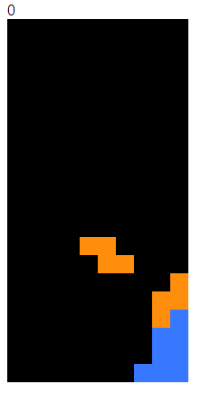

# 자바스크립트 테트리스

* Vanila JS로 만든 테트리스 게임

## 배운 것
* canvas 2d를 활용한 게임 만들기
* 2중 배열을 통한 테트리스 아이템 구현
* 키보드 이벤트 실제로 사용한 건 처음이었음

## 문제점 (수정 중)
* 왼쪽으로 가는 건 block 되는데 오른쪽으로 가는 영역이 block되지 않음. 함수 나중에 살펴볼 것.
* 점수 반영이 안됨, console로 조작하면 되는데 실제론 인식 못하는 거 같음
